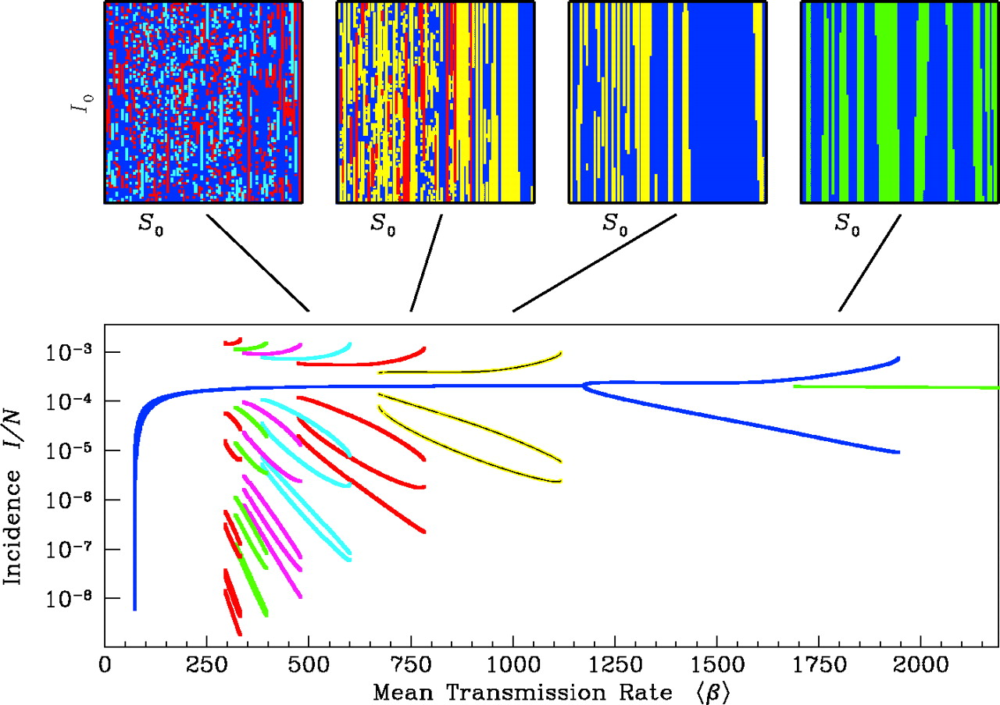

# Multistrain models

* [Slides](slides.html)

### Exercise: Modeling multiple strains

Suppose we have time series of cases caused by two strains, and we want to know if the strains interact. 
To develop expectations of the possible behaviors of two strains, we build a simple, ODE-based model.
The one below has been adapted from [Keeling & Rohani (2007)](http://homepages.warwick.ac.uk/~masfz/ModelingInfectiousDiseases/Chapter4/Program_4.1/index.html).
Subscript indices refer to the status with respect to strains 1 and 2, respectively.

**(1) Draw the compartmental diagram for this model, adding parameters to the flows. What could each parameter represent? What kinds of restrictions (e.g., bounded between 0 and 1) make sense for each?**

**(2) Is this a history-based or status-based model? Does it favor coexistence?**

**(3) What is the model assuming about the duration and strength of interaction? What other potential modes of interaction are missing from this model?**

**(4) Consider two strains of your favorite antigenically variable pathogen. If you wanted to make a model that captures the basic dynamics of these strains, which assumptions of this model would you relax first?**

**(Optional) Solve analytically for the equilibria and conditions for invasion for each strain when the other is at its endemic equilibrium.**

Compare answers with your neighbors, and be sure to raise any interesting points of disagreement (or agreement or confusion) with the class.

Let's assume we think this model is a pretty good starting point.
We'll numerically integrate these equations using Euler's method to get a sense of what they predict.
Open `two_strain.py` and examine the code.
The function takes the time steps at which to solve the state variables (which should have an equal interval, if we're using Euler's method; `steps`), the parameters (`params`), and the initial conditions (`ic`).
The actual integration is performed by an ODE solver [`odeint`](http://docs.scipy.org/doc/scipy/reference/generated/scipy.integrate.odeint.html#scipy.integrate.odeint) in [`scipy.integrate`](http://docs.scipy.org/doc/scipy/reference/integrate.html). 
This solver by default uses an adaptive time step, although we'll be forcing it to use Euler's method with a time step of our choosing.

**(5) Modify the parameters so that the strains do not interact, and examine the resulting time series. How can you confirm that the integration is accurate?**

**(6) Make the time step of the numeric integration much larger. What happens?**

**(7) Without allowing for interaction, see if you can adjust the parameters to obtain the following scenarios: (i) the strains have biennial, out-of-phase dynamics, and (ii) both strains are chaotic. Do you see any recurring patterns in the chaotic dynamics?** 

**(8) Now add interactions between the strains. How do the dynamics differ?**

As you've probably discovered, SIR-type models with seasonal forcing can generate diverse patterns.
We'll create bifurcation diagrams over several of the parameters we're interested in to summarize these behaviors.
Bifurcation diagrams summarize the *equilibrium* behavior of a system as one parameter is varied.
These summaries are often "strobes" of the system (e.g., the number of cases every Jan. 1), but sometimes they show all maxima and minima over some period.
Often, for each value of the varied parameter, the system is simulated to equilibrium from different starting conditions.
This approach can reveal the presence of multiple attractors, as shown in the diagram below for a single-strain model ([Earn et al. 2001](http://www.sciencemag.org/cgi/pmidlookup?view=long&pmid=10650003)).

For simplicity, we'll create our bifurcation diagrams using the same initial conditions throughout.

**(9) Carefully choose reasonable default values for all your parameters. Then create bifurcation diagrams, independently sweeping over `alpha`, `a`, and `beta`. What would seeing chaotic, annual, or biennial dynamics indicate about the strains?**

**(10) Is having reduced transmission following infection with the heterologous strain dynamically equivalent to have reduced susceptibility?**

You might be wondering why we should bother with all this exploration. 
(Can't we just fit the darn things already?)
Fitting fails all the time, and it's important to understand why.
This is also a useful tool to investigate the results from inference. 

**(11) Let's say you obtained an estimate of `beta` from fitting the model. You make a bifurcation diagram, and it indicates that a 5% increase in `beta` would shift the system to chaotic dynamics. The time series don't show chaotic dynamics. What do you conclude? What if your estimate of `beta` came from experiment?** 

### Additional resources
* Lipsitch et al. 2009. [No coexistence for free: Neutral null models for multistrain pathogens](http://www.ncbi.nlm.nih.gov/pmc/articles/PMC3099423/) *Epidemics* 1:2-13.
* Wikramaratna et al. 2015. [Five challenges in modelling interacting strain dynamics](http://www.sciencedirect.com/science/article/pii/S1755436514000619) *Epidemics* 10:31-34.
* Keeling, M. & P. Rohani. 2007. [Modeling Infectious Disease in Humans and Animals](http://press.princeton.edu/titles/8459.html) Princeton UP, Princeton NJ.