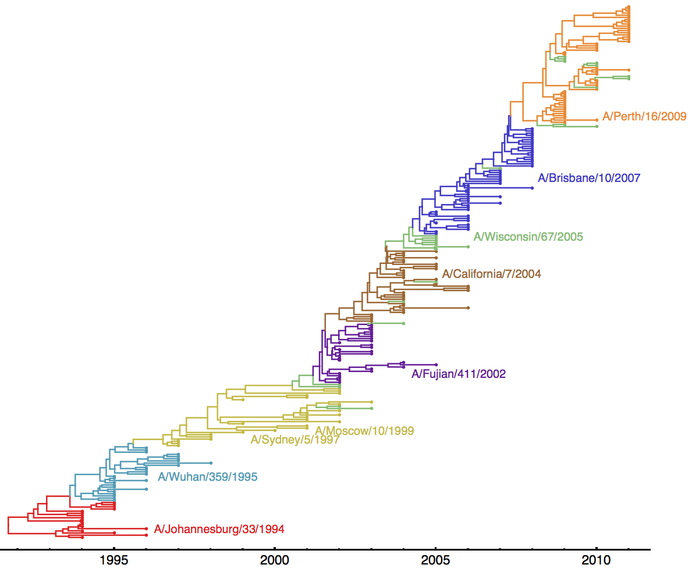

## Analyze antigenic turnover and vaccine strain selection

Vaccine strain selection for the Northern Hemisphere influenza vaccine occurs in a very regimented schedule with a February meeting to decide the following winter's vaccine. In one example, in the February 2015 meeting, the WHO basically had strains through Dec 2014 to pick from, for a vaccine that will be administered starting in ~Nov 2015.

Historical vaccine choices can be found [here](http://www.fludb.org/brc/vaccineRecommend.spg?decorator=influenza). Below, I'm showing the same MCC tree from the last section, but annotated with all Northern Hemisphere vaccine strains used between 1994 and 2011.

*Right click and open in new window to see a larger version.*

Thus, we had 8 updates between 1995 and 2011.

Each major antigenic cluster transition occurs on the trunk of the phylogeny. This indicates that the new antigenic cluster takes over the virus population and outcompetes the previously circulating cluster.

Here, I'm showing the first isolate in the dataset from each antigenic cluster:

Vaccine strain      | First isolate from cluster
------------------- | --------------------------
A/Wuhan/359/1995    | 1995
A/Sydney/5/1997     | 1997
A/Moscow/10/1999    | (same cluster as Sidney/97)
A/Fujian/411/2002   | 2002
A/California/7/2004 | 2003
A/Wisconsin/67/2005 | 2005
A/Brisbane/10/2007  | 2005
A/Perth/16/2009     | 2009

It appears that WHO vaccine updates closely mirror observed antigenic transitions in H3N2.

*Given this phylogeny and analysis, what general steps be taken to improve influenza vaccine strain selection?*