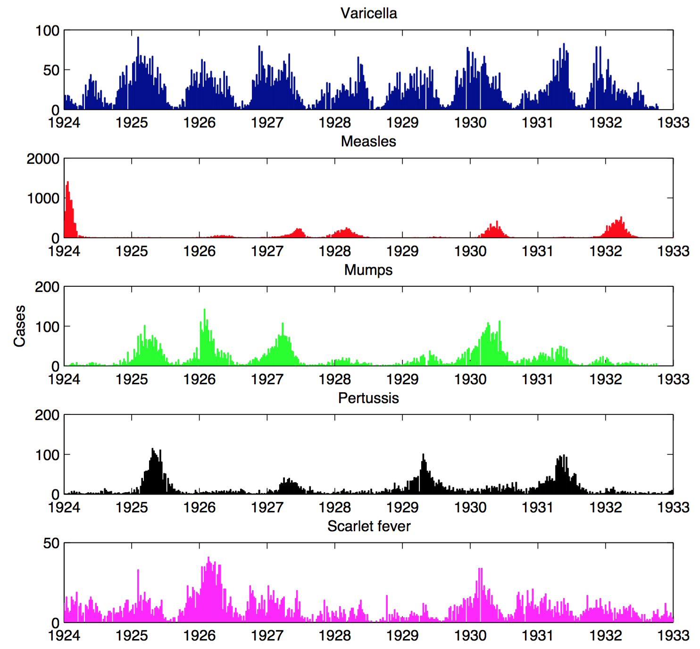
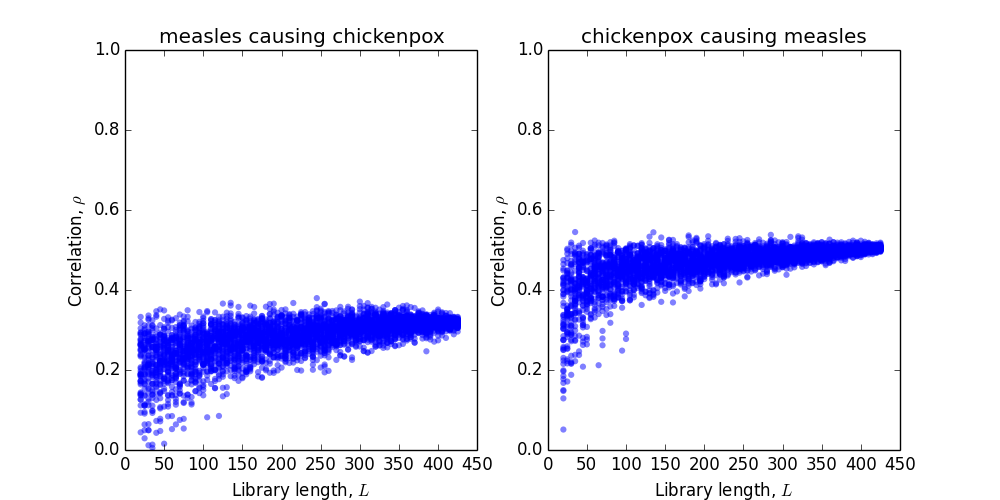

# State-space reconstruction

* [Slides](slides.html)

### Exercise

In this exercise, we'll test the ability of convergent cross-mapping to infer interactions. 
With our code (courtesy of Ed Baskerville; repo coming soon), this requires a few steps:

1. Prepare the inputs. Convert a csv file of the time series to a sqlite database using `csv2sqlite.py`. The first column of the csv file must be time, and the second two are observations. The first row should be the column labels (starting with 'time'). The csv file can be generated with `csv2sqlite.py input.csv input.sqlite time_series`. (The last argument creates a table called 'time_series' in the database.)

2. Run CCM on the inputs using `ccm.py`, specifying the embedding dimension (`E`), lag (`t`), library lengths at which to calculate the correlation (`L`), the number of replicates per library length (`R`), the columns to use (`C`), the causality tests to run (`V`), the input databases and relevant table, and the output database. Example: `
ccm.py --n-cores 4 -E 4 -t 1 -L "5:50:5" -R 100 -C "x,y" -V "x:y,y:x" input.sqlite time_series output.sqlite`. Note that we're not trying to identify the best embedding dimension or lag at this point, although this is an important step in state-space reconstruction. For now, estimate reasonable values for `E` and `t`.

3. Plot the results using `plot_rhos.py`. Specify the database with the CCM results and the name of the file where the plot will be saved.

Several of the pathogens below, which we saw in the morning, are reputed to interact ([Rohani et al. 2003](http://www.ncbi.nlm.nih.gov/pubmed/12712203), [Mina et al. 2015](http://www.sciencemag.org/content/348/6235/694)).

What happens when we run CCM on them? We might obtain something like this:

What should we make of these trends? Let's work with simulated time series to get a better grasp of the  method.

**(1) Start with perfect and abundant observations of a deterministic system. Generate time series using the code from the first exercise. First simulate strains that are not interacting, and then simulate strains that are. When you run CCM, what do you obtain in each case? What happens if you remove seasonal forcing?**

**(2) Now let's assume we have observations that contain a little bit of measurement error. Add white noise to these time series--you choose the strength. Before examining the results, think about how observation error should affect the correlations.**

**(3) Now let's analyze a system that is perfectly observed but contains some process error in the transmission term. We can simulate stochastic differential equations by using the Euler method with process noise, i.e., the [Euler-Maruyama method](https://en.wikipedia.org/wiki/Euler%E2%80%93Maruyama_method). Add some process noise to the transmission rate. How does process noise affect inference?**

**(4) Finally, let's assume our system is deterministic but starts away from equilibrium. 
(We might also ask what happens if one of the parameters is nonstationary.) How does this change affect the results?**

**(Optional) See how changing the embedding dimension and lag affect your results.**

**(Optional) Reconstruct some of the trajectories in state-space.**

### Additional resources
* Sugihara et al. 2012. [Detecting causality in complex ecosystems](http://www.sciencemag.org/content/338/6106/496.long) *Science* 338(6106):496-500.
* He et al. 2015. [Equation-free mechanistic ecosystem forecasting using empirical dynamic modeling](http://www.pnas.org/content/112/13/E1569.abstract) *PNAS* 112(13):E1569-1576.